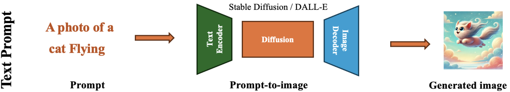
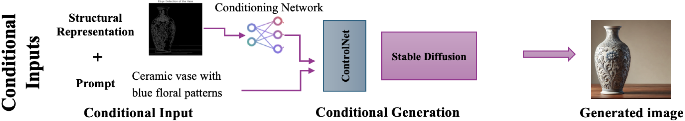

<div align="center">

# 🚀 AMD Stable Diffusion Sandbox

### High-Performance AI Stable Diffusion Image Generation on AMD Ryzen AI Hardware

[](LICENSE)
[](https://www.python.org/downloads/)
[](https://www.amd.com/en/developer/resources/ryzen-ai-software.html)
[](https://discord.gg/amd-dev)

</div>


---

## 📑 Contents
- **[🎯 What is This?](#-what-is-this)** - Overview and introduction
- **[📜 Supported Models](#-supported-models)** - List of supported SD models
- **[🏞️ Image Generation Methods](#️-image-generation-methods)** - Description of text-to-image, image-to-image, inpainting, removal, outpainting
- **[📐 Hardware Prerequisites](#-hardware-prerequisites)** - AMD hardware requirements
- **[🚀 Quick Start](#-quick-start)** - Installation process: get up and running
- **[🧩 Pipelines and Pipeline Groups Configuration](#-pipelines-and-pipeline-groups-configuration)** - Configure YAML and JSON files
- **[▶️ Running Pipelines](#️-running-pipelines)** - How to execute pipelines and pipeline groups
- **[📤 Output](#-output)** - Generated images, results, and logs
- **[💬 Community & Support](#-community--support)** - Get help and connect

---

## 🎯 What is This?

**AMD SD Sandbox** is a framework for running Stable Diffusion (SD) models accelerated by **AMD Ryzen AI hardware**. It provides an easy-to-use interface for evaluating, comparing, and deploying multiple SD pipelines. When developing AI-powered applications with SD, developers face several challenges:

| 🚫 Problem | ✅ Solution |
|-----------|------------|
| **Model Selection Complexity** - Dozens of SD models exist, each with different capabilities and tradeoffs, requiring separate tools and interfaces | **Unified Pipeline Interface** - Run any supported SD model with consistent commands and a single orchestration framework |
| **Hardware Optimization Guesswork** - Need to compare NPU vs GPU vs CPU performance to justify hardware investments and optimize deployments | **Built-in Performance Benchmarking** - Automated profiling with CPU baseline comparison to measure real acceleration gains with the NPU |
| **Tedious Manual Testing** - Testing multiple prompts across multiple models requires repetitive manual work and scattered results | **Automated Batch Processing** - Test hundreds of prompts across multiple models automatically with organized result management |
| **Code Modification Barriers** - Official examples require source code changes for simple customizations like prompts or resolution | **No-Code Customization** - Configure everything via YAML files and CLI arguments without adjusting source code |

[Back to Table of Contents](#-contents)

---

## 📜 Supported Models

The RAI 1.7.0 release of the sd-sandbox supports a limited set of models focused on text-to-image generation.

Here is a list of currently supported SD models. Note that these models have had nodes replaced with custom ops specifically designed for AMD NPUs. The models can be downloaded from the Ryzen AI docs site here: 
**[Ryzen AI Stable Diffusion Demo](https://ryzenai.docs.amd.com/en/latest/sd_demo.html#installation-steps)**.

| Model | Folder Name | Output Resolution | Text-To-Image | Image-To-Image | Inpainting | Removal | Outpainting |
|-------|-------|---------------|----------------|------------|-------------|-------------| -------------|
| SD 1.5 | sd_15 | 512x512 | ✅ | | | | |
| SD Turbo | sd_turbo | 512x512 | ✅ | | | | |
| SD Turbo Batch Size 1 | sd_turbo_bs1 | 512x512 | ✅ | | | | |
| SD XL Base | sdxl-base-1.0 | 1024x1024 |  ✅ | | | | |
| SD XL Turbo | sdxl_turbo | 512x512 | ✅ | | | | |
| SD XL Turbo Batch Size 1  | sdxl_turbo_bs1 | 512x512 |  ✅ | | | | |
| SD 2.1 | sd21_base | 512x512 | ✅ | | | | |
| SD 2.1-V | sd-2.1-v | 768x768 | ✅ | | | | |
| Segmind-Vega | segmind_vega | 1024x1024 | ✅ | | | | |

[Back to Table of Contents](#-contents)


---

## 🏞️ Image Generation Methods 

> Note: *No modification has been made to the image generation methods sections from RAI 1.6.0 release docs. The models and examples described below will by supported in RAI 1.7.1*

Here are some explanations of each of the SD methods. Note that pre- and post-processing padding and depadding are applied to the images where the resolutions do not match the model's inference resolution.

**🎨 Text-To-Image (T2I)** — Generate images from scratch using only text descriptions. Simply provide a prompt like "a mountain landscape at sunset" and the model creates a completely new image based on your description.
*Example use cases: concept art, marketing visuals, creative exploration, rapid prototyping*




> Image Source: Bousetouane, Fouad. 2025. "Generative AI for Vision: A Comprehensive Study of Frameworks and Applications." https://arxiv.org/abs/2501.18033v1.

<p align="center">• • •</p>

**🔄 Image-To-Image (I2I)** — Transform an existing image based on a text prompt while preserving certain structural or compositional elements. You provide both a reference image and a prompt, and the model generates a new image that follows the guidance of the input image while incorporating your text description.
*Example use cases: style transfer, image variations, artistic reinterpretation, photo enhancement*



> Image Source: Bousetouane, Fouad. 2025. "Generative AI for Vision: A Comprehensive Study of Frameworks and Applications." https://arxiv.org/abs/2501.18033v1.

<p align="center">• • •</p>

**🖌️ Inpainting** — Edit or modify specific regions within an existing image. You provide an image, mark the area you want to change with a mask, and describe what should appear in that region. The model intelligently fills in the masked area while blending seamlessly with the surrounding content.
*Example Use Cases: Object removal/replacement, photo retouching, fixing defects, adding elements to scenes*

*Example: Edit specific regions of an image while preserving the rest:*

**Prompt:** *"A girl taking a pig for a walk on the street"*


| Original Image | Mask (Region to Edit) | Result |
|:--------------:|:---------------------:|:------:|
|  |  |  |
> Image Source: Created by author.

<p align="center">• • •</p>

**🧹 Removal** — Intelligently remove unwanted objects, people, or elements from images. Similar to inpainting, but specifically optimized for removing content and filling the space naturally with appropriate background or context-aware content.
*Example Use Cases: Removing photobombers, cleaning up backgrounds, deleting unwanted objects, decluttering scenes*

*Example: Clean object removal with intelligent background fill*

| Original Image | Mask (Object to Remove) | Result |
|:--------------:|:-----------------------:|:------:|
|  |  |  |
> Image Source: Created by author.

<p align="center">• • •</p>

**🖼️ Outpainting** — Extend an image beyond its original boundaries while maintaining visual coherence. Provide an image and the model generates new content around the edges, effectively expanding your canvas while keeping the style and context consistent with the original.
*Example use cases: expanding cropped photos, creating wider panoramas, extending backgrounds, enlarging canvas for composition*

*Example: Expand canvas while maintaining style and context coherence*

**Prompt:** *"Extend top and right by 512 pixels"*

| Original Image | Extended Result |
|:------------------------:|:---------------------------:|
|  |  |
> Image Source: Created by author.

[Back to Table of Contents](#-contents)

---

## 📐 Hardware Prerequisites

Before getting started, make sure you meet the minimum hardware and OS requirements:

| Series | Codename | Abbreviation | Graphics Model | Launch Year | Windows 11 | Linux |
|--------|----------|--------------|----------------|-------------------|-------------|---------|
| [Ryzen AI Max PRO 300 Series](https://www.amd.com/en/partner/articles/ryzen-ai-pro-300-series-processors.html) | Strix Halo | STX | Radeon 8000S Series | 2025 | ☑️ | |
| [Ryzen AI PRO 300 Series](https://www.amd.com/en/partner/articles/ryzen-ai-pro-300-series-processors.html) | Strix Point / Krackan Point | STX/KRK | Radeon 800M Series | 2025 | ☑️ | |
| [Ryzen AI Max 300 Series](https://www.amd.com/en/partner/articles/ryzen-ai-300-series-processors.html) | Strix Halo | STX | Radeon 8000S Series | 2025 | ☑️ | |
| [Ryzen AI 300 Series](https://www.amd.com/en/partner/articles/ryzen-ai-300-series-processors.html) | Strix Point | STX | Radeon 800M Series | 2025 | ☑️ | |

[Back to Table of Contents](#-contents)

---

## 🚀 Quick Start

#### Step 1: Install latest NPU Drivers and Ryzen AI SW

Follow the instructions here to download necessary NPU drivers and Ryzen AI SW: [Ryzen AI SW Installation Instructions](https://ryzenai.docs.amd.com/en/latest/inst.html). Please allow for around **30 minutes** to install all of the necessary components of Ryzen AI SW.

#### Step 2: Clone this repository

```bash
git clone https://github.com/amd/sd-sandbox.git
cd sd-sandbox
```

#### Step 3: Set Up Conda Environment

From step 1, the conda environment should already be installed. No modifications are needed to the conda environment for this release
. Activate it with 
```powershell
conda activate ryzen-ai-1.7.0

```

#### Step 4: Install Python Dependencies

Install the required Python packages using pip:

```powershell
pip install -r requirements.txt
```


#### Step 4: Copy Required Libraries

Copy the Ryzen AI runtime libraries `lib` to the `sd-sandbox` main project folder.

```powershell
# PowerShell command
Copy-Item -Path "C:\Program Files\RyzenAI\1.7.0\GenAI-SD\lib" -Destination . -Recurse -Force
```

#### Step 5: Download Models

1. Visit the [Ryzen AI Stable Diffusion Demo](https://ryzenai.docs.amd.com/en/latest/sd_demo.html#installation-steps) and download the ZIP files with the models (SD 1.5, SDXL, etc.).

2. Create the models directory, extract the zipped files, and place the folders per the structure outlined below.

```powershell
# Create models directory
New-Item -ItemType Directory -Path "models" -Force

```
Folder structure:
```text
models/
├── sd_15/
├── sd_turbo/
└── ...
```

#### Step 6: Configure Paths

Now that you have the models, you need to configure paths by editing [config/pipeline_configs.yaml](config/pipeline_configs.yaml). The bare minimum that you need to change in order to run a pipeline is:

1. The global paths `models_path`, the image output path `test_path`, and the `prompt_file` path:
```yaml
paths:
  models_path: "C:/Users/amd87/sd_sandbox/models"
  test_path: "C:/Users/amd87/sd_sandbox/test"
  prompt_file: "C:/Users/amd87/sd_sandbox/config/artistic_prompts.json"
```

2. The `onnx_custom_ops.dll` file:
```yaml
defaults:
  custom_op_path: "C:/Program Files/RyzenAI/1.7.0/deployment/onnx_custom_ops.dll"
```

3. The `--model_path` for each individual pipeline. For example, for the `sd_15` pipeline:

```yaml
pipelines:
  sd_15:
    extra_args:
      - "--model_path"
      - "C:/Users/amd87/sd_sandbox/models/sd_15"
```

More details on configurations can be found in the [Pipelines and Pipeline Groups Configuration](#-pipelines-and-pipeline-groups-configuration) section.

#### Step 9: Hugging Face Credentials

In order to access model files, you may need to visit the Hugging Face website and request access. 

1. For SD 3, you can visit https://huggingface.co/stabilityai/stable-diffusion-3-medium-diffusers and request access.
2. Generate and copy your token from https://huggingface.co/settings/tokens. Select "Read access to contents of all repos under your personal namespace" and "Read access to contents of all public gated repos you can access" and then "Create token". 
3. Authenticate on your machine with:
```powershell
huggingface-cli login
```

In your output, you should see among other things:

```text
Login successful.
```

#### Step 8: Verify Installation

Verify that the main run script shows the possible pipelines and pipeline groups: 

```bash
python scripts/run_pipelines.py --list
```

You should see a list of all available pipelines and groups of pipelines similar to this:
```text
⚡ Automatic provider selection enabled
   • Will use best available: GPU > NPU > CPU
   • Available providers: DmlExecutionProvider, CPUExecutionProvider

==================================================
Available Pipelines
==================================================
  sd_15                     - SD 1.5 Pipeline
  sd_turbo                  - SD Turbo Pipeline
  sd_turbo_bs1              - SD Turbo BS1 Pipeline
  sdxl_base                 - SDXL Base Pipeline
  sdxl_turbo                - SDXL Turbo Pipeline
...

==================================================
Available Pipeline Groups
==================================================
  all_sdxl      - sdxl_base, sdxl_turbo, sdxl_turbo_bs1 
  all turbo    - sd_turbo, sd_turbo_bs1, sdxl_turbo, sdxl_turbo_bs1
...
```

You should now be able to run a pipeline with:

```powershell
python scripts/run_pipelines.py --pipelines sd_15
```

And get an output similar to:

```text
[AUTO] Automatic provider selection enabled
   • Will use best available: DML > CPU
   • Available providers: DmlExecutionProvider, CPUExecutionProvider

============================================================
Running 1 pipelines in QUICK TEST mode
============================================================

--- Pipeline 1/1: SD 1.5 Pipeline ---
[AUTO] SD 1.5 Pipeline - Automatic provider selection
  [Output] Live Output:
     ---Loading ONNX Unet for DD
     2025-11-24 10:11:14,521 [INFO] Load unet/dd ...

...

     2025-11-24 10:11:44,580 [INFO] Total NPU memory usage: 1521.66MB (1.49GB)
[OK] SUCCESS in 36.5s
   [Dir] Images saved to: generated_images/

============================================================
SUMMARY - QUICK TEST MODE
============================================================
Total runs: 1
Successful: 1/1 (100.0%)
Total duration: 0:00:36.465767

Results saved to: C:\Users\User\bconsolv\sd_sandbox\results\pipeline_results_quick_20251124_101145.txt

```

[Back to Table of Contents](#-contents)

---

## 🧩 Pipelines and Pipeline Groups Configuration

Now that everything is installed, you are ready to configure and run SD pipelines. Pipelines are defined in the [config/pipeline_configs.yaml](config/pipeline_configs.yaml) configuration file and can be run via the main [scripts/run_pipelines.py](scripts/run_pipelines.py) script.

A pipeline is a complete SD workflow configuration that includes a specific model (e.g., SD 1.5, SDXL, SD 3.0), execution script, and parameters (resolution, inference steps, guidance scale). Each pipeline represents a single configured image generation setup, from text/image input to final image output.

Pipelines can be arranged into **groups** for common workflows (e.g., all SDXL models, all ControlNet models, etc.) to simplify running multiple pipelines at once. To create a pipeline group, simply list the desired pipelines under a group name in the [config/pipeline_configs.yaml](config/pipeline_configs.yaml) file.

### 📁 Config Directory

An overview of the directory structure that contains pipeline files and configurations is given below. The [config](config) directory contains two file types: [YAML](#yaml-files) and [JSON](#json-files).

#### YAML Files
YAML files define pipeline configurations, parameters, and execution settings. Here are the important YAML files:
- [config/pipeline_configs.yaml](config/pipeline_configs.yaml) - Default configuration file used by the framework
- [config/pipeline_configs_debug.yaml](config/pipeline_configs_debug.yaml) - Debug configuration with specialized settings
- `pipeline_custom_config.yaml` - If not using the default, custom YAML files can be used with the `--config` argument as below:
```powershell
python scripts/run_pipelines.py --pipelines sd_15 --config pipeline_custom_config.yaml
```

The [config/pipeline_configs.yaml](config/pipeline_configs.yaml) file has 3 main sections:
1. Global Pipeline Defaults
2. Pipeline Definitions
3. Pipeline Groups

**1. Global Pipeline Defaults**

Global defaults are defined at the top of the YAML file and are useful for setting parameters that apply to all pipelines, such as the output image resolution, or an external prompt file. The global defaults can always be overridden on a per-pipeline basis, by making a change to a variable in the pipeline definition.  

One example of setting a global default might be setting the `num_inference_steps` to 20. Every pipeline will use 20 inference steps unless overridden in the pipeline definition.

Some global parameters must be set to run any pipeline: the `models_path` where the models are located, the `test_path` directory containing the `run*.py` scripts, the `prompt_file` path where the prompts are located, and a `source_path` if setting up relative paths is desired.

**2. Pipeline Definitions**

Pipelines are defined in the YAML configuration file under the `pipelines` section. Each pipeline has its own set of parameters that can override the global defaults. Here are the pipeline definition parameters that must be present:

1. A unique name (e.g., `sd_15`, `sdxl_turbo`).
2. The base script associated with the pipeline (e.g., `run_sd.py`, `run_sd_xl.py`). 
3. The `--model_path` to the model folder
4. The Hugging Face `model_id` if not using a local path.

If nothing else is specified, default values will be used. However, almost all hyperparameters can be overridden on a per-pipeline basis.

In order to see all of the available parameters, the user can run `--help` on the python file specified in the  `script` pipeline defintion. All of these files are located in the `/tests/` directory. For example, to see all of the available parameters for the SDXL pipeline, you can run:

```powershell
python tests/run_sd_xl.py --help
```

The following pipeline scripts ( in `tests/run*.py`), are used under the hood to run the corresponding models listed in the table below:
| Script | Model(s) |
|--------|----------|
| run_sd.py | SD 1.5, SD Turbo, SD 2.1, SD 2.1-V |
| run_sd_xl.py | SDXL Base, SDXL Turbo, Segmind-Vega   |

Most pipeline-specific option are passed via the `extra_args` list in the yaml file. Not all options are supported yet, but most are.

The **best** way to become familiar with the available parameters is to examine the [config/pipeline_configs.yaml](config/pipeline_configs.yaml) file. 


**3. Pipeline Groups**

For convenience, you can organize pipelines into **groups** for common workflows. A pipeline group is created by creating a unique group name and listing the desired pipelines under that group in the YAML file. 

For example, the `all_sdxl` tests all SDXL models:

```yaml
  all_sdxl:
    - sdxl_base
    - sdxl_turbo
    - sdxl_turbo_bs1
```

To run this pipeline group, you can run with the `--pipeline_groups` command as follows:

```powershell
python scripts/run_pipelines.py --pipeline_groups all_sdxl
```

You can also create your own pipeline groups by modifying the YAML file under `pipeline_groups` to specify which pipelines you would like to run:

```yaml
pipeline_groups:
  my_custom_pipeline_group: #group identifier
    - sd_turbo
    - sdxl_turbo
```

#### JSON Files
Each JSON file contains an array of text prompts passed sequentially to pipelines for batch testing. The example JSON files can be found here:
- [config/artistic_prompts.json](config/artistic_prompts.json), [config/anime_prompts.json](config/artistic_prompts.json), [config/alt_prompts.json](config/alt_prompts.json) - Themed prompt collections
<!---- [config/debug_prompt.json](config/debug_prompt.json) - Single prompt for testing -->
- `custom_prompts.json` - Your own custom prompt file
You can pass your own list of prompts with the `--prompt_file` argument. For example:

```powershell
python scripts/run_pipelines.py --pipelines sd_15 --prompt_file custom_prompts.json
```

[Back to Table of Contents](#-contents)

---

## ▶️ Running Pipelines

Pipelines are run by invoking the [scripts/run_pipelines.py](scripts/run_pipelines.py) with the desired pipeline or pipeline group specified. For example, we can run the `sd_15` pipeline with:

```powershell
python /scripts/run_pipelines.py --pipelines sd_15
```

Or we can run the `all` pipelines group with: 

```powershell
python scripts/run_pipelines.py --pipeline_groups all
```

A full list of pipeline parameters and their descriptions can be found by running `--help` on the main script:

```powershell
python scripts/run_pipelines.py --help
```

### Execution Modes

The framework supports 3 execution modes to balance speed and performance measurement. 

1. Quick Test Mode (default) - Balanced mode with one warmup iteration followed by one profiled generation, producing two images while capturing basic performance metrics for quick evaluation.

```powershell
# Test SDXL Turbo with basic performance metrics
python scripts/run_pipelines.py --pipelines sdxl_turbo --prompt "a serene mountain landscape"
```
*Output: 2 images (1 warmup + 1 profiled), basic timing statistics*

2. Image-Only Mode (`--image-only`) - Fastest execution for batch image generation with zero warmup and one generation pass, producing a single image per prompt without any profiling overhead.

```powershell
# Generate 5 images from artistic_prompts.json using SDXL Base, no profiling
python scripts/run_pipelines.py --image-only --pipelines sdxl_base --prompt_file config/anime_prompts.json

```
*Output: 5 images total (the anime_prompts.json file contains 5 prompts), 0 warmup rounds, no performance metrics*

3. Benchmark Mode (`--benchmark`) - Comprehensive profiling with one warmup iteration followed by ten profiled generations, producing eleven images total with detailed timing statistics for thorough performance analysis.

```powershell
# Benchmark SDXL with detailed profiling across all SDXL models
python scripts/run_pipelines.py --benchmark --pipeline_groups all_sdxl
```
*Output: 11 images per pipeline (1 warmup + 10 profiled), detailed performance report with timing averages and standard deviations*

### Argument priority 

The framework support argument priorities based on the following order (highest to lowest): 
1. Command-line arguments
2. Pipeline-specific YAML config
3. Global YAML defaults
4. Script-level defaults

### Pipeline Options

The following are framework-level options that can be passed at the command line, or set in the YAML configuration file. Please **read** this carefully as it describes all of the available options for running pipelines. You can run the `--help` argument to get the same information at the command line:

```powershell
python scripts/run_pipelines.py --help
```

| Option | Type | Default | Help |
|--------|------|---------|------|
| --benchmark | flag | False | Enable benchmark mode (10 profiling rounds). Default is quick mode (1 round). |
| --timeout | int | 600 | Timeout in seconds for each run (default: 600) |
| --script | list |  | Run only these script names (e.g. --script run_sd.py run_sd_xl.py) |
| --model_id | list |  | Run only these model IDs (e.g. --model_id runwayml/stable-diffusion-v1-5) |
| --pipelines | list |  | Run specific pipelines by name (e.g. --pipelines sd_15 sdxl_base) |
| --pipeline_groups | list |  | Run pipeline groups (e.g. --pipeline_groups sd_21 quick_test) |
| --list | flag | False | List available pipelines and groups, then exit |
| --prompt | str |  | Custom prompt to use for all pipelines |
| --prompt_file | str |  | Path to JSON file containing list of prompts to run through each pipeline |
| ~~--sd3-controlnet-mode~~ | ~~str~~ | ~~controlnet~~ | ~~For SD3 ControlNet with prompt files: 'controlnet' uses custom prompts with ControlNet enabled (recommended), 'text2img' converts to text-to-image mode without ControlNet guidance (default: controlnet)~~ |
| --force-cpu | flag | False | Force CPU-only execution (disables GPU, DML, and all accelerators). Overrides config setting. |
| --disable-vitisai | flag | False | Disable Vitis AI acceleration (FPGA/AI accelerators). Use with --force-cpu for complete CPU-only execution. Overrides config setting. |
| --no-summary | flag | False | Skip printing the detailed summary report and skip saving results to disk |
| --config | str | config/pipeline_configs.yaml | Path to custom YAML configuration file (default: config/pipeline_configs.yaml) |
| --clean-images | flag | False | Remove all existing images and Excel files from generated_images folder before running pipelines |
| --clean-results | flag | False | Remove all existing result files from results folder before running pipelines |
| --save-log | flag | False | Save complete log output to a text file when any pipeline has streaming output enabled |
| --image-only | flag | Fale | Generate images only without profiling (batch mode). Disables warmup and profiling rounds for fastest execution. |
| --traceback | flag | False | Include full traceback in error messages for detailed debugging |
| --custom-op-path | str | | Path to onnx_custom_ops.dll (Windows)

[Back to Table of Contents](#-contents)

---

## 📤 Output

When running [scripts/run_pipelines.py](scripts/run_pipelines.py), the outputs are images and result text files in specific locations with organized naming conventions.

### Generated Images

Images by default can be found in `test/generated_images/`. Filenames include model name, resolution, number of steps, image index, and timestamp (e.g., `test/generated_images/stable-diffusion-v1-5_0_512x512_steps20_idx0_20251124_101132.png`).

> **Note:** You can use the `--clean-images` flag to remove all existing images from the `generated_images` folder before running any pipelines. 

### Results Text Files

Results files can be found in `results/` directory (e.g., `results/pipeline_results_quick_20251124_100116.txt`). They contain execution status (success/failure), duration, timing data, model information, resolution, and error messages for all pipelines run in a session.

> **Note:** You can disable the generation of summary files by using the `--no-summary` flag when running the main script. You can also use the `--clean-results` flag to remove all existing result files from the `results` folder before running any pipelines.

### Log Files

You can choose to save all lines printed to the console at runtime with the`--save-log` flag when running the main script. Log files are saved in the `results/` directory and contain the complete console output from all pipeline executions, including detailed progress messages, warnings, and debug information (eg., `results\pipeline_log_quick_20251124_102713.txt`).

### Benchmark Files

When using the benchmarking mode (`--benchmark`), the results text file includes the benchmarking information (e.g., `results/pipeline_results_benchmark_20251124_102713.txt`). 

After creating the `pipeline_results_benchmark_*.txt` files, you can run the [scripts/process_benchmark_results.py](scripts/process_benchmark_results.py) script to extract benchmark data. This CSV can be imported into Excel for performance analysis and comparison. To generate the CSV file, simply run:

```powershell
python scripts/process_benchmark_results.py
```

And you should get an output of CSV files (e.g., `benchmark_summary_20251124_104406.csv`) with an output similar to:

```csv
Model Name,Resolution,Inference Steps,NPU Models Load Time (s),All Models Load Time (s),1st Gen Pipeline Time (s),Avg Pipeline Time (s),NPU Memory Usage (MB),Total Memory Usage (MB)
SD 1.5 Pipeline,512x512,20,3.898902,3.899352,5.979673,5.978549,1527.36,4412.52
```

[Back to Table of Contents](#-contents)

---

## 💬 Community & Support

<div align="center">

[](https://discord.gg/amd-dev)

</div>

- **AMD Ryzen AI Documentation**: [https://ryzenai.docs.amd.com/](https://ryzenai.docs.amd.com/)
- **AMD Driver Support Portal**: [https://www.amd.com/en/support](https://www.amd.com/en/support)

[Back to Table of Contents](#-contents)

---

<div align="center">

**⭐ If this framework helped your development, consider starring the repository! ⭐**

*Built with ❤️ by AMD for the AI developer community*

</div>